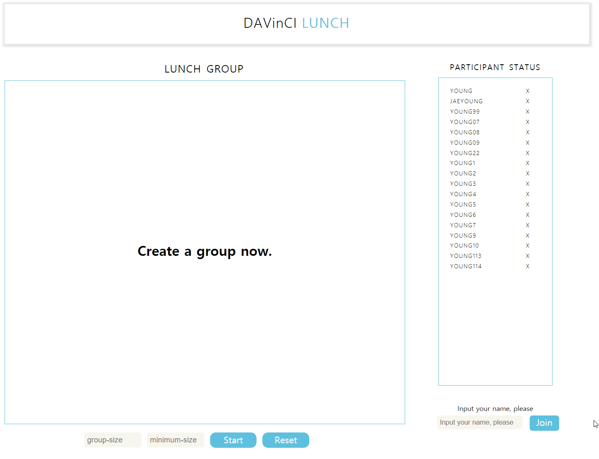

# LUNCH - client
 

## Content

- [Requirements](#requirements)
- [Installation](#installation)
- [Features](#features)
- [Skills](#skills)
- [Tests](#tests)
- [Things-To-Do](#things-To-Do)
- [Sincere-Thanks](#Sincere-Thanks)

## Requirements

- 1024px 이상의 큰 브라우저 환경에서 실행해야 합니다.(반응형 작업은 하지 않았습니다.)
- 브라우저는 최신 버전 크롬 사용을 권장합니다.

## Installation

<pre>
cd lunch-client
yarn install
yarn start
</pre>

## Features

1. 현재 참가 인원 보여주기

- 현재 데이터베이스에 있는 참가자 리스트를 보여주는 UI를 구현했습니다.
- 데이터베이스에 존재하는 참가자의 리스트를 서버를 통해서 데이터를  받아서 브라우저 오른쪽 영역에 출력되도록 했습니다.
- 리스트 박스에는 참가자의 이름과 삭제 버튼이 있으며 스크롤 가능하게 구성했습니다.

2. 참가자 추가하기 & 삭제하기

- 참가자 현황을 보여주는 리스트 밑의 영역에 참가자를 추가할 수 있는 UI를 구현했습니다. 
- Input 태그를 통해서 정보를 입력 받아 서버로 POST 한 이후 데이터베이스에 추가했습니다.
- 만약 입력한 이름이 리스트에 존재한다면 에러 메세지를 보여주고 이름을 데이터베이스에 저장하지 않게 만들었습니다.

3. 주어진 조건을 통해 랜덤으로 그룹 만들기

- 중앙 메인 영역 밑에 그룹의 숫자와 최소 인원을 입력할 수 있는 Input UI를 구현하였습니다. 
- 입력 받은 조건을 서버로 보낸 다음, 서버에서 조건을 통해서 랜덤으로 그룹을 생성하게 하였습니다.
- 만약 주어진 조건으로 그룹을 생성하지 못한 경우, 메인 영역에 그룹 대신 에러 메세지를 출력하도록 하였습니다.

## Skills Client

- ES2015+
- React
- Redux
- Sass

## Test
- Component Unit Test (Jest, Enzyme)

## Things-To-Do

- 이번 과제에선 반응형 페이지로 구현하지 못 했습니다. 기획 단계부터 세밀하게 구성해 반응형 페이지로 만들고 싶습니다.

## Sincere-Thanks
- 온라인 과제를 할 수 있어서 감사하게 생각합니다. 과제를 하면서 공부할 수 있어서 재미있고 좋았습니다. 기회를 주셔서 감사합니다.
